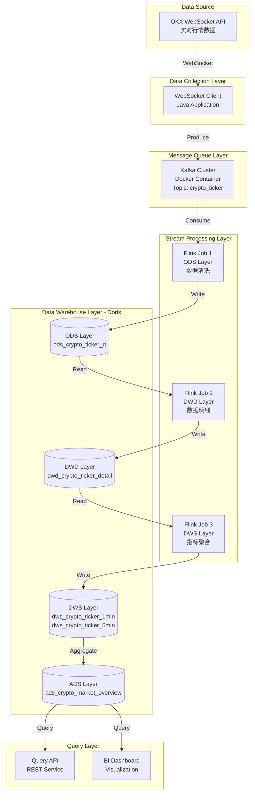
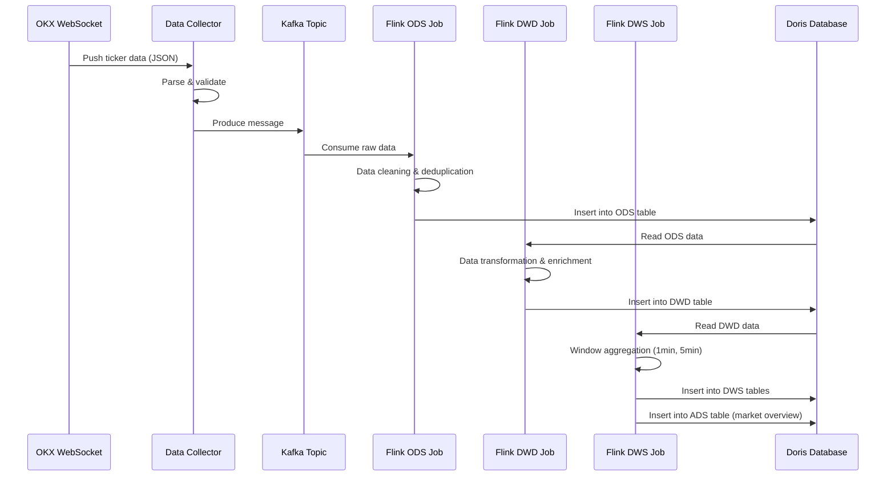

# Design Document: Realtime Crypto Datawarehouse

## Overview

本项目构建一个实时加密货币数据仓库系统，通过 WebSocket 订阅 OKX 交易所的实时行情数据，使用 Kafka 作为消息队列进行数据缓冲，Flink 进行实时流处理和计算，最终将处理后的数据存储到 Doris 数据仓库中。系统采用经典的数仓分层架构（ODS/DWD/DWS/ADS），支持实时指标计算和查询分析。

技术栈选择基于以下考虑：Kafka 3.6.1 提供高吞吐量的消息队列能力，Flink 1.18.0 提供强大的流处理和状态管理能力，Doris 2.0.4 提供高性能的 OLAP 分析能力。所有组件均使用 Java 8+ 开发，确保良好的生态兼容性和企业级稳定性。

项目采用模块化设计，包含数据采集模块（WebSocket Client）、消息队列模块（Kafka）、流处理模块（Flink Jobs）和数据存储模块（Doris）。系统支持水平扩展，可根据数据量动态调整 Kafka 分区数和 Flink 并行度。

## Technology Stack

### Core Components

| Component | Version | Rationale |
|-----------|---------|-----------|
| Java | 11 | LTS 版本，Flink 1.18 推荐使用 Java 11 |
| Kafka | 3.6.1 | 最新稳定版，支持 KRaft 模式，无需 ZooKeeper |
| Flink | 1.18.0 | 最新稳定版，支持 Table API 和 Flink CDC |
| Doris | 2.0.4 | 最新稳定版，支持实时写入和高性能查询 |
| Maven | 3.8+ | 项目构建和依赖管理 |
| Docker | 20.10+ | Kafka 容器化部署 |

### Key Dependencies

```xml
<!-- Flink Core -->
<dependency>
    <groupId>org.apache.flink</groupId>
    <artifactId>flink-streaming-java</artifactId>
    <version>1.18.0</version>
</dependency>

<!-- Flink Kafka Connector -->
<dependency>
    <groupId>org.apache.flink</groupId>
    <artifactId>flink-connector-kafka</artifactId>
    <version>3.0.2-1.18</version>
</dependency>

<!-- Flink JDBC Connector for Doris -->
<dependency>
    <groupId>org.apache.flink</groupId>
    <artifactId>flink-connector-jdbc</artifactId>
    <version>3.1.2-1.18</version>
</dependency>
```


## Architecture

### System Architecture Diagram



### Data Flow Architecture




## Components and Interfaces

### Component 1: WebSocket Data Collector

**Purpose**: 订阅 OKX WebSocket API，接收实时行情数据并发送到 Kafka

**Interface**:
```java
public interface IDataCollector {
    /**
     * 启动 WebSocket 连接并开始采集数据
     * @param symbols 交易对列表，例如 ["BTC-USDT", "ETH-USDT"]
     * @throws CollectorException 连接失败或配置错误时抛出
     */
    void start(List<String> symbols) throws CollectorException;
    
    /**
     * 停止数据采集并关闭连接
     */
    void stop();
    
    /**
     * 获取采集器运行状态
     * @return true 表示正在运行，false 表示已停止
     */
    boolean isRunning();
    
    /**
     * 获取采集统计信息
     * @return 包含消息数量、错误数等统计信息
     */
    CollectorMetrics getMetrics();
}

public interface IKafkaProducer {
    /**
     * 发送消息到 Kafka
     * @param topic Kafka 主题名称
     * @param key 消息键（用于分区）
     * @param value 消息内容（JSON 格式）
     * @return 发送结果的 Future 对象
     */
    CompletableFuture<RecordMetadata> send(String topic, String key, String value);
    
    /**
     * 关闭生产者并释放资源
     */
    void close();
}
```

**Responsibilities**:
- 建立并维护 WebSocket 连接
- 解析 OKX 行情数据格式
- 数据验证和异常处理
- 将数据发送到 Kafka 指定 Topic
- 监控连接状态并自动重连

### Component 2: Flink ODS Job

**Purpose**: 从 Kafka 消费原始数据，进行清洗和去重，写入 ODS 层

**Interface**:
```java
public interface IODSProcessor {
    /**
     * 处理原始行情数据
     * @param rawData 原始 JSON 数据
     * @return 清洗后的 ODS 数据对象
     * @throws DataValidationException 数据格式错误时抛出
     */
    ODSTickerData process(String rawData) throws DataValidationException;
    
    /**
     * 数据去重判断
     * @param data 待检查的数据
     * @return true 表示重复数据，false 表示新数据
     */
    boolean isDuplicate(ODSTickerData data);
}

public interface IDorisWriter<T> {
    /**
     * 批量写入数据到 Doris
     * @param records 数据记录列表
     * @throws WriteException 写入失败时抛出
     */
    void write(List<T> records) throws WriteException;
    
    /**
     * 刷新缓冲区，确保数据写入
     */
    void flush();
}
```

**Responsibilities**:
- 消费 Kafka 消息
- 数据格式验证和清洗
- 基于时间戳的去重
- 写入 Doris ODS 表
- 处理写入失败和重试


### Component 3: Flink DWD Job

**Purpose**: 从 ODS 层读取数据，进行数据转换和字段补充，写入 DWD 层

**Interface**:
```java
public interface IDWDProcessor {
    /**
     * 转换 ODS 数据为 DWD 数据
     * @param odsData ODS 层数据
     * @return 转换后的 DWD 数据
     */
    DWDTickerDetail transform(ODSTickerData odsData);
    
    /**
     * 数据字段补充和计算
     * @param dwdData DWD 数据对象
     * @return 补充完整的 DWD 数据
     */
    DWDTickerDetail enrich(DWDTickerDetail dwdData);
}
```

**Responsibilities**:
- 读取 ODS 表数据
- 数据类型转换
- 计算衍生字段（涨跌幅、振幅等）
- 数据标准化处理
- 写入 DWD 表

### Component 4: Flink DWS Job

**Purpose**: 从 DWD 层读取数据，进行时间窗口聚合，计算统计指标，写入 DWS 和 ADS 层

**Interface**:
```java
public interface IDWSProcessor {
    /**
     * 窗口聚合计算
     * @param windowData 窗口内的数据列表
     * @param windowSize 窗口大小（分钟）
     * @return 聚合后的指标数据
     */
    DWSTickerMetrics aggregate(List<DWDTickerDetail> windowData, int windowSize);
    
    /**
     * 计算技术指标
     * @param metricsData 聚合指标数据
     * @return 包含技术指标的数据
     */
    DWSTickerMetrics calculateIndicators(DWSTickerMetrics metricsData);
}

public interface IADSProcessor {
    /**
     * 生成市场概览数据
     * @param dwsDataList 多个交易对的 DWS 数据
     * @return 市场概览数据
     */
    ADSMarketOverview generateMarketOverview(List<DWSTickerMetrics> dwsDataList);
}
```

**Responsibilities**:
- 读取 DWD 表数据
- 时间窗口划分（1分钟、5分钟）
- 聚合计算（开高低收、成交量等）
- 技术指标计算（MA、EMA 等）
- 写入 DWS 和 ADS 表


## Data Models

### ODS Layer: ods_crypto_ticker_rt

**Purpose**: 存储原始行情数据，保持数据完整性

```java
public class ODSTickerData {
    private String instId;           // 交易对，例如 "BTC-USDT"
    private Long timestamp;          // 时间戳（毫秒）
    private BigDecimal lastPrice;    // 最新成交价
    private BigDecimal bidPrice;     // 买一价
    private BigDecimal askPrice;     // 卖一价
    private BigDecimal bidSize;      // 买一量
    private BigDecimal askSize;      // 卖一量
    private BigDecimal volume24h;    // 24小时成交量
    private BigDecimal high24h;      // 24小时最高价
    private BigDecimal low24h;       // 24小时最低价
    private String dataSource;       // 数据源标识 "OKX"
    private Long ingestTime;         // 数据入库时间
}
```

**Doris Table DDL**:
```sql
CREATE TABLE ods_crypto_ticker_rt (
    inst_id VARCHAR(50),
    timestamp BIGINT,
    last_price DECIMAL(20, 8),
    bid_price DECIMAL(20, 8),
    ask_price DECIMAL(20, 8),
    bid_size DECIMAL(20, 8),
    ask_size DECIMAL(20, 8),
    volume_24h DECIMAL(30, 8),
    high_24h DECIMAL(20, 8),
    low_24h DECIMAL(20, 8),
    data_source VARCHAR(20),
    ingest_time BIGINT
)
DUPLICATE KEY(inst_id, timestamp)
DISTRIBUTED BY HASH(inst_id) BUCKETS 10
PROPERTIES (
    "replication_num" = "1",
    "storage_medium" = "SSD"
);
```

**Validation Rules**:
- instId 不能为空
- timestamp 必须为正数且在合理范围内（当前时间前后1小时）
- lastPrice, bidPrice, askPrice 必须大于 0
- volume24h, high24h, low24h 必须大于等于 0

### DWD Layer: dwd_crypto_ticker_detail

**Purpose**: 存储清洗后的明细数据，包含计算字段

```java
public class DWDTickerDetail {
    private String instId;
    private Long timestamp;
    private Date tradeDate;          // 交易日期
    private Integer tradeHour;       // 交易小时
    private BigDecimal lastPrice;
    private BigDecimal bidPrice;
    private BigDecimal askPrice;
    private BigDecimal spread;       // 买卖价差
    private BigDecimal spreadRate;   // 价差率
    private BigDecimal volume24h;
    private BigDecimal high24h;
    private BigDecimal low24h;
    private BigDecimal priceChange24h;  // 24小时涨跌额
    private BigDecimal priceChangeRate24h; // 24小时涨跌幅
    private BigDecimal amplitude24h;     // 24小时振幅
    private String dataSource;
    private Long ingestTime;
    private Long processTime;        // 处理时间
}
```

**Doris Table DDL**:
```sql
CREATE TABLE dwd_crypto_ticker_detail (
    inst_id VARCHAR(50),
    timestamp BIGINT,
    trade_date DATE,
    trade_hour INT,
    last_price DECIMAL(20, 8),
    bid_price DECIMAL(20, 8),
    ask_price DECIMAL(20, 8),
    spread DECIMAL(20, 8),
    spread_rate DECIMAL(10, 6),
    volume_24h DECIMAL(30, 8),
    high_24h DECIMAL(20, 8),
    low_24h DECIMAL(20, 8),
    price_change_24h DECIMAL(20, 8),
    price_change_rate_24h DECIMAL(10, 6),
    amplitude_24h DECIMAL(10, 6),
    data_source VARCHAR(20),
    ingest_time BIGINT,
    process_time BIGINT
)
DUPLICATE KEY(inst_id, timestamp)
PARTITION BY RANGE(trade_date) ()
DISTRIBUTED BY HASH(inst_id) BUCKETS 10
PROPERTIES (
    "replication_num" = "1",
    "dynamic_partition.enable" = "true",
    "dynamic_partition.time_unit" = "DAY",
    "dynamic_partition.start" = "-7",
    "dynamic_partition.end" = "3",
    "dynamic_partition.prefix" = "p",
    "dynamic_partition.buckets" = "10"
);
```

**Validation Rules**:
- 所有价格字段必须大于 0
- spread = askPrice - bidPrice，必须大于等于 0
- spreadRate = spread / lastPrice，必须在 [0, 1] 范围内
- priceChangeRate24h 和 amplitude24h 必须在合理范围内（-100%, +1000%）


### DWS Layer: dws_crypto_ticker_1min / dws_crypto_ticker_5min

**Purpose**: 存储时间窗口聚合数据，支持 K 线分析

```java
public class DWSTickerMetrics {
    private String instId;
    private Long windowStart;        // 窗口开始时间
    private Long windowEnd;          // 窗口结束时间
    private Integer windowSize;      // 窗口大小（分钟）
    private BigDecimal openPrice;    // 开盘价
    private BigDecimal highPrice;    // 最高价
    private BigDecimal lowPrice;     // 最低价
    private BigDecimal closePrice;   // 收盘价
    private BigDecimal volume;       // 成交量
    private BigDecimal avgPrice;     // 平均价
    private BigDecimal priceChange;  // 涨跌额
    private BigDecimal priceChangeRate; // 涨跌幅
    private Integer tickCount;       // Tick 数量
    private BigDecimal ma5;          // 5周期移动平均
    private BigDecimal ma10;         // 10周期移动平均
    private Long processTime;
}
```

**Doris Table DDL**:
```sql
CREATE TABLE dws_crypto_ticker_1min (
    inst_id VARCHAR(50),
    window_start BIGINT,
    window_end BIGINT,
    window_size INT,
    open_price DECIMAL(20, 8),
    high_price DECIMAL(20, 8),
    low_price DECIMAL(20, 8),
    close_price DECIMAL(20, 8),
    volume DECIMAL(30, 8),
    avg_price DECIMAL(20, 8),
    price_change DECIMAL(20, 8),
    price_change_rate DECIMAL(10, 6),
    tick_count INT,
    ma5 DECIMAL(20, 8),
    ma10 DECIMAL(20, 8),
    process_time BIGINT
)
AGGREGATE KEY(inst_id, window_start, window_end, window_size)
DISTRIBUTED BY HASH(inst_id) BUCKETS 10
PROPERTIES (
    "replication_num" = "1"
);

-- 5分钟表结构相同
CREATE TABLE dws_crypto_ticker_5min LIKE dws_crypto_ticker_1min;
```

**Validation Rules**:
- windowStart < windowEnd
- openPrice, highPrice, lowPrice, closePrice 必须大于 0
- highPrice >= max(openPrice, closePrice)
- lowPrice <= min(openPrice, closePrice)
- volume >= 0
- tickCount > 0

### ADS Layer: ads_crypto_market_overview

**Purpose**: 存储市场概览数据，支持实时监控

```java
public class ADSMarketOverview {
    private Long timestamp;
    private Integer totalSymbols;        // 交易对总数
    private Integer risingCount;         // 上涨数量
    private Integer fallingCount;        // 下跌数量
    private Integer flatCount;           // 平盘数量
    private BigDecimal totalVolume;      // 总成交量
    private BigDecimal avgPriceChangeRate; // 平均涨跌幅
    private String topGainer;            // 涨幅最大交易对
    private BigDecimal topGainerRate;    // 最大涨幅
    private String topLoser;             // 跌幅最大交易对
    private BigDecimal topLoserRate;     // 最大跌幅
    private String mostActive;           // 成交量最大交易对
    private BigDecimal mostActiveVolume; // 最大成交量
    private Long processTime;
}
```

**Doris Table DDL**:
```sql
CREATE TABLE ads_crypto_market_overview (
    timestamp BIGINT,
    total_symbols INT,
    rising_count INT,
    falling_count INT,
    flat_count INT,
    total_volume DECIMAL(30, 8),
    avg_price_change_rate DECIMAL(10, 6),
    top_gainer VARCHAR(50),
    top_gainer_rate DECIMAL(10, 6),
    top_loser VARCHAR(50),
    top_loser_rate DECIMAL(10, 6),
    most_active VARCHAR(50),
    most_active_volume DECIMAL(30, 8),
    process_time BIGINT
)
DUPLICATE KEY(timestamp)
DISTRIBUTED BY HASH(timestamp) BUCKETS 5
PROPERTIES (
    "replication_num" = "1"
);
```

**Validation Rules**:
- totalSymbols = risingCount + fallingCount + flatCount
- totalVolume >= 0
- topGainerRate > 0, topLoserRate < 0


## Key Functions with Formal Specifications

### Function 1: WebSocketDataCollector.handleMessage()

```java
public void handleMessage(String message) throws DataProcessingException
```

**Preconditions:**
- WebSocket 连接已建立且处于活跃状态
- message 不为 null 且不为空字符串
- Kafka Producer 已初始化且可用

**Postconditions:**
- 如果消息格式有效，数据已发送到 Kafka topic
- 如果消息格式无效，记录错误日志但不中断处理流程
- metrics 计数器已更新（成功或失败计数）
- 不抛出未捕获的异常

**Loop Invariants:** N/A

### Function 2: ODSProcessor.cleanAndValidate()

```java
public ODSTickerData cleanAndValidate(String rawJson) throws DataValidationException
```

**Preconditions:**
- rawJson 不为 null
- rawJson 是有效的 JSON 字符串

**Postconditions:**
- 返回的 ODSTickerData 对象所有必填字段非 null
- 所有价格字段 > 0
- timestamp 在合理范围内（当前时间 ± 1小时）
- 如果验证失败，抛出 DataValidationException 并包含详细错误信息

**Loop Invariants:** N/A

### Function 3: DWDProcessor.calculateDerivedFields()

```java
public DWDTickerDetail calculateDerivedFields(ODSTickerData odsData)
```

**Preconditions:**
- odsData 不为 null
- odsData 已通过 ODS 层验证
- odsData.lastPrice, bidPrice, askPrice, high24h, low24h 均大于 0

**Postconditions:**
- 返回的 DWDTickerDetail 包含所有计算字段
- spread = askPrice - bidPrice >= 0
- spreadRate = spread / lastPrice，范围 [0, 1]
- priceChange24h = lastPrice - (high24h + low24h) / 2
- priceChangeRate24h = priceChange24h / ((high24h + low24h) / 2)
- amplitude24h = (high24h - low24h) / low24h
- 所有计算结果精度保持 8 位小数

**Loop Invariants:** N/A

### Function 4: DWSProcessor.aggregateWindow()

```java
public DWSTickerMetrics aggregateWindow(
    String instId,
    List<DWDTickerDetail> windowData,
    long windowStart,
    long windowEnd,
    int windowSize
)
```

**Preconditions:**
- instId 不为 null 且不为空
- windowData 不为 null 且不为空列表
- windowStart < windowEnd
- windowSize > 0
- windowData 中所有元素的 instId 相同
- windowData 按 timestamp 升序排列

**Postconditions:**
- 返回的 DWSTickerMetrics 对象包含完整的 OHLC 数据
- openPrice = windowData 中第一条记录的 lastPrice
- closePrice = windowData 中最后一条记录的 lastPrice
- highPrice = windowData 中所有 lastPrice 的最大值
- lowPrice = windowData 中所有 lastPrice 的最小值
- highPrice >= max(openPrice, closePrice)
- lowPrice <= min(openPrice, closePrice)
- volume = windowData 中所有 volume24h 的变化量总和
- avgPrice = windowData 中所有 lastPrice 的算术平均值
- tickCount = windowData.size()
- priceChange = closePrice - openPrice
- priceChangeRate = priceChange / openPrice

**Loop Invariants:**
- 遍历 windowData 时，已处理的记录保持 timestamp 升序
- 累积的 highPrice 始终是已处理记录中的最大值
- 累积的 lowPrice 始终是已处理记录中的最小值


### Function 5: DWSProcessor.calculateMovingAverage()

```java
public BigDecimal calculateMovingAverage(
    String instId,
    int periods,
    long currentWindowEnd,
    List<DWSTickerMetrics> historicalData
)
```

**Preconditions:**
- instId 不为 null 且不为空
- periods > 0
- currentWindowEnd > 0
- historicalData 不为 null
- historicalData 包含至少 periods 条记录
- historicalData 按 windowEnd 升序排列
- historicalData 中所有元素的 instId 相同

**Postconditions:**
- 返回的 BigDecimal 是最近 periods 个窗口的 closePrice 算术平均值
- 结果精度为 8 位小数
- 如果 historicalData 记录数 < periods，返回 null

**Loop Invariants:**
- 遍历 historicalData 时，累积的价格总和始终等于已处理记录的 closePrice 之和
- 已处理的记录数量不超过 periods

### Function 6: ADSProcessor.generateMarketOverview()

```java
public ADSMarketOverview generateMarketOverview(
    List<DWSTickerMetrics> latestMetrics,
    long timestamp
)
```

**Preconditions:**
- latestMetrics 不为 null 且不为空列表
- latestMetrics 中每个交易对只有一条最新记录
- timestamp > 0
- latestMetrics 中所有元素的 windowSize 相同

**Postconditions:**
- 返回的 ADSMarketOverview 包含完整的市场统计信息
- totalSymbols = latestMetrics.size()
- risingCount = 涨跌幅 > 0 的交易对数量
- fallingCount = 涨跌幅 < 0 的交易对数量
- flatCount = 涨跌幅 = 0 的交易对数量
- totalSymbols = risingCount + fallingCount + flatCount
- totalVolume = 所有交易对的 volume 总和
- avgPriceChangeRate = 所有交易对 priceChangeRate 的算术平均值
- topGainer 是 priceChangeRate 最大的交易对
- topLoser 是 priceChangeRate 最小的交易对
- mostActive 是 volume 最大的交易对

**Loop Invariants:**
- 遍历 latestMetrics 时，已统计的交易对数量等于已处理的记录数
- 累积的 totalVolume 等于已处理记录的 volume 之和
- topGainerRate 始终是已处理记录中的最大 priceChangeRate
- topLoserRate 始终是已处理记录中的最小 priceChangeRate


## Algorithmic Pseudocode

### Main Processing Algorithm: WebSocket Data Collection

```java
/**
 * WebSocket 数据采集主流程
 */
public class WebSocketDataCollector implements IDataCollector {
    
    private WebSocketClient wsClient;
    private IKafkaProducer kafkaProducer;
    private CollectorMetrics metrics;
    private volatile boolean running;
    
    @Override
    public void start(List<String> symbols) throws CollectorException {
        // 前置条件检查
        assert symbols != null && !symbols.isEmpty() : "Symbols list cannot be empty";
        assert kafkaProducer != null : "Kafka producer must be initialized";
        
        try {
            // 步骤 1: 构建 WebSocket 订阅消息
            String subscribeMessage = buildSubscribeMessage(symbols);
            
            // 步骤 2: 建立 WebSocket 连接
            wsClient = new WebSocketClient(OKX_WS_URL);
            wsClient.setMessageHandler(this::handleMessage);
            wsClient.setErrorHandler(this::handleError);
            wsClient.connect();
            
            // 步骤 3: 发送订阅请求
            wsClient.send(subscribeMessage);
            
            // 步骤 4: 标记为运行状态
            running = true;
            metrics.incrementConnectionCount();
            
            logger.info("WebSocket collector started for symbols: {}", symbols);
            
        } catch (Exception e) {
            running = false;
            throw new CollectorException("Failed to start collector", e);
        }
        
        // 后置条件检查
        assert running == true : "Collector should be in running state";
        assert wsClient.isConnected() : "WebSocket should be connected";
    }
    
    private void handleMessage(String message) {
        // 前置条件
        assert message != null && !message.isEmpty() : "Message cannot be null or empty";
        assert running == true : "Collector must be running";
        
        try {
            // 步骤 1: 解析 JSON 消息
            JsonNode jsonNode = objectMapper.readTree(message);
            
            // 步骤 2: 验证消息格式
            if (!isValidTickerMessage(jsonNode)) {
                metrics.incrementInvalidMessageCount();
                logger.warn("Invalid message format: {}", message);
                return;
            }
            
            // 步骤 3: 提取数据字段
            JsonNode data = jsonNode.get("data").get(0);
            String instId = data.get("instId").asText();
            
            // 步骤 4: 构建 Kafka 消息
            String kafkaKey = instId;
            String kafkaValue = data.toString();
            
            // 步骤 5: 发送到 Kafka
            kafkaProducer.send(KAFKA_TOPIC, kafkaKey, kafkaValue)
                .thenAccept(metadata -> {
                    metrics.incrementSuccessCount();
                    logger.debug("Sent to Kafka: {} partition={} offset={}", 
                        instId, metadata.partition(), metadata.offset());
                })
                .exceptionally(ex -> {
                    metrics.incrementFailureCount();
                    logger.error("Failed to send to Kafka: {}", instId, ex);
                    return null;
                });
            
        } catch (Exception e) {
            metrics.incrementErrorCount();
            logger.error("Error processing message", e);
        }
        
        // 后置条件：metrics 已更新
        assert metrics.getTotalProcessed() > 0 : "Metrics should be updated";
    }
}
```

**Preconditions:**
- OKX WebSocket API 可访问
- Kafka 集群运行正常
- symbols 列表包含有效的交易对

**Postconditions:**
- WebSocket 连接已建立
- 订阅消息已发送
- 消息处理器已注册
- 采集器处于运行状态

**Loop Invariants:**
- 消息处理循环中，每条消息独立处理
- 单条消息失败不影响后续消息处理
- metrics 计数器单调递增


### Flink ODS Job Algorithm

```java
/**
 * Flink ODS 数据处理作业
 */
public class FlinkODSJob {
    
    public static void main(String[] args) throws Exception {
        // 步骤 1: 创建 Flink 执行环境
        StreamExecutionEnvironment env = StreamExecutionEnvironment.getExecutionEnvironment();
        env.setParallelism(4);
        env.enableCheckpointing(60000); // 1分钟 checkpoint
        
        // 步骤 2: 配置 Kafka Source
        KafkaSource<String> kafkaSource = KafkaSource.<String>builder()
            .setBootstrapServers("localhost:9092")
            .setTopics("crypto_ticker")
            .setGroupId("flink-ods-consumer")
            .setStartingOffsets(OffsetsInitializer.latest())
            .setValueOnlyDeserializer(new SimpleStringSchema())
            .build();
        
        // 步骤 3: 创建数据流
        DataStream<String> rawStream = env.fromSource(
            kafkaSource,
            WatermarkStrategy.noWatermarks(),
            "Kafka Source"
        );
        
        // 步骤 4: 数据清洗和转换
        DataStream<ODSTickerData> odsStream = rawStream
            .map(new ODSCleanFunction())
            .filter(data -> data != null);
        
        // 步骤 5: 去重处理（基于时间窗口）
        DataStream<ODSTickerData> dedupStream = odsStream
            .keyBy(ODSTickerData::getInstId)
            .process(new DeduplicationFunction(5000)); // 5秒去重窗口
        
        // 步骤 6: 写入 Doris
        dedupStream.addSink(new DorisSink<>(
            DorisOptions.builder()
                .setFenodes("localhost:8030")
                .setTableIdentifier("crypto_dw.ods_crypto_ticker_rt")
                .setUsername("root")
                .setPassword("")
                .build(),
            DorisExecutionOptions.builder()
                .setBatchSize(100)
                .setBatchIntervalMs(1000)
                .setMaxRetries(3)
                .build()
        ));
        
        // 步骤 7: 执行作业
        env.execute("Flink ODS Job");
    }
    
    /**
     * ODS 数据清洗函数
     */
    public static class ODSCleanFunction implements MapFunction<String, ODSTickerData> {
        
        private ObjectMapper objectMapper = new ObjectMapper();
        
        @Override
        public ODSTickerData map(String value) throws Exception {
            // 前置条件
            assert value != null && !value.isEmpty();
            
            try {
                // 步骤 1: 解析 JSON
                JsonNode jsonNode = objectMapper.readTree(value);
                
                // 步骤 2: 提取字段
                ODSTickerData data = new ODSTickerData();
                data.setInstId(jsonNode.get("instId").asText());
                data.setTimestamp(jsonNode.get("ts").asLong());
                data.setLastPrice(new BigDecimal(jsonNode.get("last").asText()));
                data.setBidPrice(new BigDecimal(jsonNode.get("bidPx").asText()));
                data.setAskPrice(new BigDecimal(jsonNode.get("askPx").asText()));
                data.setBidSize(new BigDecimal(jsonNode.get("bidSz").asText()));
                data.setAskSize(new BigDecimal(jsonNode.get("askSz").asText()));
                data.setVolume24h(new BigDecimal(jsonNode.get("vol24h").asText()));
                data.setHigh24h(new BigDecimal(jsonNode.get("high24h").asText()));
                data.setLow24h(new BigDecimal(jsonNode.get("low24h").asText()));
                data.setDataSource("OKX");
                data.setIngestTime(System.currentTimeMillis());
                
                // 步骤 3: 数据验证
                if (!validate(data)) {
                    return null; // 无效数据返回 null，后续被过滤
                }
                
                // 后置条件
                assert data.getInstId() != null;
                assert data.getLastPrice().compareTo(BigDecimal.ZERO) > 0;
                
                return data;
                
            } catch (Exception e) {
                // 解析失败返回 null
                return null;
            }
        }
        
        private boolean validate(ODSTickerData data) {
            // 验证必填字段
            if (data.getInstId() == null || data.getInstId().isEmpty()) {
                return false;
            }
            
            // 验证时间戳（当前时间前后1小时）
            long now = System.currentTimeMillis();
            long diff = Math.abs(now - data.getTimestamp());
            if (diff > 3600000) {
                return false;
            }
            
            // 验证价格字段
            if (data.getLastPrice().compareTo(BigDecimal.ZERO) <= 0 ||
                data.getBidPrice().compareTo(BigDecimal.ZERO) <= 0 ||
                data.getAskPrice().compareTo(BigDecimal.ZERO) <= 0) {
                return false;
            }
            
            return true;
        }
    }
    
    /**
     * 去重处理函数
     */
    public static class DeduplicationFunction 
        extends KeyedProcessFunction<String, ODSTickerData, ODSTickerData> {
        
        private long dedupWindowMs;
        private transient ValueState<Long> lastTimestampState;
        
        public DeduplicationFunction(long dedupWindowMs) {
            this.dedupWindowMs = dedupWindowMs;
        }
        
        @Override
        public void open(Configuration parameters) {
            ValueStateDescriptor<Long> descriptor = 
                new ValueStateDescriptor<>("lastTimestamp", Long.class);
            lastTimestampState = getRuntimeContext().getState(descriptor);
        }
        
        @Override
        public void processElement(
            ODSTickerData value,
            Context ctx,
            Collector<ODSTickerData> out
        ) throws Exception {
            // 前置条件
            assert value != null;
            assert value.getTimestamp() != null;
            
            Long lastTimestamp = lastTimestampState.value();
            long currentTimestamp = value.getTimestamp();
            
            // 去重逻辑：如果距离上次时间戳小于去重窗口，则丢弃
            if (lastTimestamp == null || 
                currentTimestamp - lastTimestamp >= dedupWindowMs) {
                
                // 更新状态
                lastTimestampState.update(currentTimestamp);
                
                // 输出数据
                out.collect(value);
            }
            
            // 后置条件：状态已更新
            assert lastTimestampState.value() != null;
        }
    }
}
```

**Preconditions:**
- Kafka 集群运行在 localhost:9092
- Doris 集群运行在 localhost:8030
- crypto_ticker topic 已创建
- ods_crypto_ticker_rt 表已创建

**Postconditions:**
- Flink 作业成功启动
- 数据从 Kafka 消费并写入 Doris
- Checkpoint 机制保证数据不丢失
- 去重逻辑确保同一交易对 5 秒内只保留一条数据

**Loop Invariants:**
- 数据流处理中，每条记录独立处理
- 去重状态按 instId 分区存储
- Checkpoint 时状态一致性得到保证


### Flink DWS Job Algorithm: Window Aggregation

```java
/**
 * Flink DWS 窗口聚合作业
 */
public class FlinkDWSJob {
    
    public static void main(String[] args) throws Exception {
        StreamExecutionEnvironment env = StreamExecutionEnvironment.getExecutionEnvironment();
        env.setParallelism(4);
        env.enableCheckpointing(60000);
        
        // 步骤 1: 从 Doris 读取 DWD 数据（使用 JDBC Source）
        // 注意：实际生产中可能使用 Flink CDC 或定时批量读取
        DataStream<DWDTickerDetail> dwdStream = createDWDStream(env);
        
        // 步骤 2: 分配水印（基于事件时间）
        DataStream<DWDTickerDetail> watermarkedStream = dwdStream
            .assignTimestampsAndWatermarks(
                WatermarkStrategy
                    .<DWDTickerDetail>forBoundedOutOfOrderness(Duration.ofSeconds(10))
                    .withTimestampAssigner((event, timestamp) -> event.getTimestamp())
            );
        
        // 步骤 3: 1分钟窗口聚合
        DataStream<DWSTickerMetrics> metrics1min = watermarkedStream
            .keyBy(DWDTickerDetail::getInstId)
            .window(TumblingEventTimeWindows.of(Time.minutes(1)))
            .process(new WindowAggregationFunction(1));
        
        // 步骤 4: 5分钟窗口聚合
        DataStream<DWSTickerMetrics> metrics5min = watermarkedStream
            .keyBy(DWDTickerDetail::getInstId)
            .window(TumblingEventTimeWindows.of(Time.minutes(5)))
            .process(new WindowAggregationFunction(5));
        
        // 步骤 5: 计算移动平均线
        DataStream<DWSTickerMetrics> enriched1min = metrics1min
            .keyBy(DWSTickerMetrics::getInstId)
            .process(new MovingAverageFunction(5, 10));
        
        DataStream<DWSTickerMetrics> enriched5min = metrics5min
            .keyBy(DWSTickerMetrics::getInstId)
            .process(new MovingAverageFunction(5, 10));
        
        // 步骤 6: 写入 Doris DWS 表
        enriched1min.addSink(createDorisSink("dws_crypto_ticker_1min"));
        enriched5min.addSink(createDorisSink("dws_crypto_ticker_5min"));
        
        // 步骤 7: 生成 ADS 市场概览
        DataStream<ADSMarketOverview> marketOverview = enriched1min
            .windowAll(TumblingEventTimeWindows.of(Time.minutes(1)))
            .process(new MarketOverviewFunction());
        
        marketOverview.addSink(createDorisSink("ads_crypto_market_overview"));
        
        env.execute("Flink DWS Job");
    }
    
    /**
     * 窗口聚合函数
     */
    public static class WindowAggregationFunction 
        extends ProcessWindowFunction<DWDTickerDetail, DWSTickerMetrics, String, TimeWindow> {
        
        private int windowSizeMinutes;
        
        public WindowAggregationFunction(int windowSizeMinutes) {
            this.windowSizeMinutes = windowSizeMinutes;
        }
        
        @Override
        public void process(
            String instId,
            Context context,
            Iterable<DWDTickerDetail> elements,
            Collector<DWSTickerMetrics> out
        ) throws Exception {
            // 前置条件
            assert instId != null && !instId.isEmpty();
            assert elements != null;
            
            List<DWDTickerDetail> dataList = new ArrayList<>();
            elements.forEach(dataList::add);
            
            // 前置条件：窗口内至少有一条数据
            assert !dataList.isEmpty() : "Window should contain at least one element";
            
            // 步骤 1: 初始化聚合变量
            DWSTickerMetrics metrics = new DWSTickerMetrics();
            metrics.setInstId(instId);
            metrics.setWindowStart(context.window().getStart());
            metrics.setWindowEnd(context.window().getEnd());
            metrics.setWindowSize(windowSizeMinutes);
            
            // 步骤 2: 计算 OHLC
            BigDecimal openPrice = dataList.get(0).getLastPrice();
            BigDecimal closePrice = dataList.get(dataList.size() - 1).getLastPrice();
            BigDecimal highPrice = BigDecimal.ZERO;
            BigDecimal lowPrice = new BigDecimal("999999999");
            BigDecimal sumPrice = BigDecimal.ZERO;
            BigDecimal totalVolume = BigDecimal.ZERO;
            
            // 循环不变式：
            // - highPrice 是已处理记录中的最大价格
            // - lowPrice 是已处理记录中的最小价格
            // - sumPrice 是已处理记录的价格总和
            for (DWDTickerDetail data : dataList) {
                BigDecimal price = data.getLastPrice();
                
                if (price.compareTo(highPrice) > 0) {
                    highPrice = price;
                }
                if (price.compareTo(lowPrice) < 0) {
                    lowPrice = price;
                }
                
                sumPrice = sumPrice.add(price);
                totalVolume = totalVolume.add(data.getVolume24h());
            }
            
            // 步骤 3: 设置聚合结果
            metrics.setOpenPrice(openPrice);
            metrics.setClosePrice(closePrice);
            metrics.setHighPrice(highPrice);
            metrics.setLowPrice(lowPrice);
            metrics.setVolume(totalVolume);
            metrics.setAvgPrice(sumPrice.divide(
                new BigDecimal(dataList.size()), 
                8, 
                RoundingMode.HALF_UP
            ));
            metrics.setTickCount(dataList.size());
            
            // 步骤 4: 计算涨跌幅
            BigDecimal priceChange = closePrice.subtract(openPrice);
            BigDecimal priceChangeRate = priceChange.divide(
                openPrice, 
                6, 
                RoundingMode.HALF_UP
            );
            metrics.setPriceChange(priceChange);
            metrics.setPriceChangeRate(priceChangeRate);
            
            metrics.setProcessTime(System.currentTimeMillis());
            
            // 后置条件验证
            assert metrics.getHighPrice().compareTo(metrics.getOpenPrice()) >= 0;
            assert metrics.getHighPrice().compareTo(metrics.getClosePrice()) >= 0;
            assert metrics.getLowPrice().compareTo(metrics.getOpenPrice()) <= 0;
            assert metrics.getLowPrice().compareTo(metrics.getClosePrice()) <= 0;
            assert metrics.getTickCount() == dataList.size();
            
            out.collect(metrics);
        }
    }
    
    /**
     * 移动平均线计算函数
     */
    public static class MovingAverageFunction 
        extends KeyedProcessFunction<String, DWSTickerMetrics, DWSTickerMetrics> {
        
        private int ma5Periods;
        private int ma10Periods;
        private transient ListState<BigDecimal> priceHistoryState;
        
        public MovingAverageFunction(int ma5Periods, int ma10Periods) {
            this.ma5Periods = ma5Periods;
            this.ma10Periods = ma10Periods;
        }
        
        @Override
        public void open(Configuration parameters) {
            ListStateDescriptor<BigDecimal> descriptor = 
                new ListStateDescriptor<>("priceHistory", BigDecimal.class);
            priceHistoryState = getRuntimeContext().getListState(descriptor);
        }
        
        @Override
        public void processElement(
            DWSTickerMetrics value,
            Context ctx,
            Collector<DWSTickerMetrics> out
        ) throws Exception {
            // 前置条件
            assert value != null;
            assert value.getClosePrice() != null;
            
            // 步骤 1: 获取历史价格列表
            List<BigDecimal> priceHistory = new ArrayList<>();
            priceHistoryState.get().forEach(priceHistory::add);
            
            // 步骤 2: 添加当前收盘价
            priceHistory.add(value.getClosePrice());
            
            // 步骤 3: 保持最多 ma10Periods 条历史记录
            if (priceHistory.size() > ma10Periods) {
                priceHistory.remove(0);
            }
            
            // 步骤 4: 计算 MA5
            if (priceHistory.size() >= ma5Periods) {
                BigDecimal ma5 = calculateMA(priceHistory, ma5Periods);
                value.setMa5(ma5);
            }
            
            // 步骤 5: 计算 MA10
            if (priceHistory.size() >= ma10Periods) {
                BigDecimal ma10 = calculateMA(priceHistory, ma10Periods);
                value.setMa10(ma10);
            }
            
            // 步骤 6: 更新状态
            priceHistoryState.clear();
            priceHistoryState.addAll(priceHistory);
            
            out.collect(value);
            
            // 后置条件
            assert priceHistory.size() <= ma10Periods;
        }
        
        private BigDecimal calculateMA(List<BigDecimal> prices, int periods) {
            // 前置条件
            assert prices.size() >= periods;
            
            BigDecimal sum = BigDecimal.ZERO;
            int startIndex = prices.size() - periods;
            
            // 循环不变式：sum 是已处理价格的总和
            for (int i = startIndex; i < prices.size(); i++) {
                sum = sum.add(prices.get(i));
            }
            
            BigDecimal ma = sum.divide(
                new BigDecimal(periods), 
                8, 
                RoundingMode.HALF_UP
            );
            
            // 后置条件
            assert ma.compareTo(BigDecimal.ZERO) > 0;
            
            return ma;
        }
    }
}
```

**Preconditions:**
- DWD 表包含实时数据
- Flink 作业有足够的内存存储状态
- 水印延迟设置合理（10秒）

**Postconditions:**
- 1分钟和5分钟 K 线数据生成
- 移动平均线计算完成
- 数据写入 DWS 表
- 市场概览数据生成并写入 ADS 表

**Loop Invariants:**
- 窗口聚合中，OHLC 计算保持正确性
- 移动平均线计算中，历史价格列表长度不超过限制
- 状态更新保证一致性


## Example Usage

### Example 1: 启动 WebSocket 数据采集器

```java
public class DataCollectorMain {
    public static void main(String[] args) {
        // 配置 Kafka Producer
        Properties kafkaProps = new Properties();
        kafkaProps.put("bootstrap.servers", "localhost:9092");
        kafkaProps.put("key.serializer", "org.apache.kafka.common.serialization.StringSerializer");
        kafkaProps.put("value.serializer", "org.apache.kafka.common.serialization.StringSerializer");
        kafkaProps.put("acks", "1");
        kafkaProps.put("retries", 3);
        
        IKafkaProducer kafkaProducer = new KafkaProducerImpl(kafkaProps);
        
        // 创建数据采集器
        IDataCollector collector = new WebSocketDataCollector(
            "wss://ws.okx.com:8443/ws/v5/public",
            kafkaProducer,
            "crypto_ticker"
        );
        
        // 订阅交易对
        List<String> symbols = Arrays.asList(
            "BTC-USDT",
            "ETH-USDT",
            "SOL-USDT",
            "BNB-USDT"
        );
        
        try {
            // 启动采集
            collector.start(symbols);
            
            // 运行 1 小时后停止
            Thread.sleep(3600000);
            collector.stop();
            
            // 打印统计信息
            CollectorMetrics metrics = collector.getMetrics();
            System.out.println("Total processed: " + metrics.getTotalProcessed());
            System.out.println("Success count: " + metrics.getSuccessCount());
            System.out.println("Failure count: " + metrics.getFailureCount());
            
        } catch (Exception e) {
            e.printStackTrace();
        } finally {
            kafkaProducer.close();
        }
    }
}
```

### Example 2: 提交 Flink ODS 作业

```bash
# 编译项目
mvn clean package

# 提交 Flink 作业到本地集群
flink run \
  --class com.crypto.dw.flink.FlinkODSJob \
  --parallelism 4 \
  target/crypto-datawarehouse-1.0.jar

# 查看作业状态
flink list

# 查看作业日志
tail -f /opt/flink/log/flink-*-taskexecutor-*.out
```

### Example 3: 查询 Doris 数据仓库

```sql
-- 查询最新行情数据（ODS 层）
SELECT 
    inst_id,
    FROM_UNIXTIME(timestamp/1000) as trade_time,
    last_price,
    bid_price,
    ask_price,
    volume_24h
FROM ods_crypto_ticker_rt
WHERE inst_id = 'BTC-USDT'
ORDER BY timestamp DESC
LIMIT 10;

-- 查询 1 分钟 K 线数据（DWS 层）
SELECT 
    inst_id,
    FROM_UNIXTIME(window_start/1000) as kline_time,
    open_price,
    high_price,
    low_price,
    close_price,
    volume,
    price_change_rate,
    ma5,
    ma10
FROM dws_crypto_ticker_1min
WHERE inst_id = 'BTC-USDT'
    AND window_start >= UNIX_TIMESTAMP(DATE_SUB(NOW(), INTERVAL 1 HOUR)) * 1000
ORDER BY window_start DESC;

-- 查询市场概览（ADS 层）
SELECT 
    FROM_UNIXTIME(timestamp/1000) as overview_time,
    total_symbols,
    rising_count,
    falling_count,
    total_volume,
    avg_price_change_rate,
    top_gainer,
    top_gainer_rate,
    top_loser,
    top_loser_rate,
    most_active,
    most_active_volume
FROM ads_crypto_market_overview
ORDER BY timestamp DESC
LIMIT 1;
```

### Example 4: Docker 部署 Kafka

```bash
# 创建 docker-compose.yml
cat > docker-compose.yml <<EOF
version: '3.8'

services:
  kafka:
    image: apache/kafka:3.6.1
    container_name: kafka
    ports:
      - "9092:9092"
      - "9093:9093"
    environment:
      KAFKA_NODE_ID: 1
      KAFKA_PROCESS_ROLES: broker,controller
      KAFKA_LISTENERS: PLAINTEXT://0.0.0.0:9092,CONTROLLER://0.0.0.0:9093
      KAFKA_ADVERTISED_LISTENERS: PLAINTEXT://localhost:9092
      KAFKA_CONTROLLER_LISTENER_NAMES: CONTROLLER
      KAFKA_LISTENER_SECURITY_PROTOCOL_MAP: CONTROLLER:PLAINTEXT,PLAINTEXT:PLAINTEXT
      KAFKA_CONTROLLER_QUORUM_VOTERS: 1@localhost:9093
      KAFKA_OFFSETS_TOPIC_REPLICATION_FACTOR: 1
      KAFKA_TRANSACTION_STATE_LOG_REPLICATION_FACTOR: 1
      KAFKA_TRANSACTION_STATE_LOG_MIN_ISR: 1
      KAFKA_LOG_DIRS: /tmp/kraft-combined-logs
      CLUSTER_ID: MkU3OEVBNTcwNTJENDM2Qk
    volumes:
      - kafka-data:/tmp/kraft-combined-logs

volumes:
  kafka-data:
EOF

# 启动 Kafka
docker-compose up -d

# 创建 Topic
docker exec -it kafka /opt/kafka/bin/kafka-topics.sh \
  --create \
  --topic crypto_ticker \
  --bootstrap-server localhost:9092 \
  --partitions 4 \
  --replication-factor 1

# 查看 Topic 列表
docker exec -it kafka /opt/kafka/bin/kafka-topics.sh \
  --list \
  --bootstrap-server localhost:9092

# 查看 Topic 详情
docker exec -it kafka /opt/kafka/bin/kafka-topics.sh \
  --describe \
  --topic crypto_ticker \
  --bootstrap-server localhost:9092
```


## Correctness Properties

### Property 1: Data Completeness

**Universal Quantification:**
```
∀ message m ∈ OKX_WebSocket_Stream:
  valid(m) ⟹ ∃ record r ∈ ODS_Table:
    r.instId = m.instId ∧ r.timestamp = m.timestamp
```

**Description**: 所有从 OKX WebSocket 接收的有效消息都必须在 ODS 表中有对应记录

**Verification Method**: 
- 对比 Kafka 消息计数与 ODS 表记录数
- 监控 Flink 作业的 numRecordsIn 和 numRecordsOut 指标
- 定期执行数据对账任务

### Property 2: Data Freshness

**Universal Quantification:**
```
∀ record r ∈ ODS_Table:
  r.ingestTime - r.timestamp ≤ 10000 (milliseconds)
```

**Description**: ODS 表中的数据延迟不超过 10 秒

**Verification Method**:
- 监控 ingestTime 和 timestamp 的差值
- 设置告警阈值，延迟超过 10 秒时触发告警
- 使用 Flink 水印机制跟踪事件时间进度

### Property 3: Data Deduplication

**Universal Quantification:**
```
∀ instId i, ∀ time window w of 5 seconds:
  |{r ∈ ODS_Table | r.instId = i ∧ r.timestamp ∈ w}| ≤ 1
```

**Description**: 同一交易对在 5 秒窗口内最多只有一条记录

**Verification Method**:
- 查询 ODS 表，检查是否存在重复记录
- 使用 Flink 状态后端验证去重逻辑
- 定期执行数据质量检查 SQL

### Property 4: OHLC Consistency

**Universal Quantification:**
```
∀ metrics m ∈ DWS_Table:
  m.highPrice ≥ max(m.openPrice, m.closePrice) ∧
  m.lowPrice ≤ min(m.openPrice, m.closePrice) ∧
  m.highPrice ≥ m.lowPrice
```

**Description**: DWS 表中的 OHLC 数据必须满足逻辑一致性

**Verification Method**:
- 在 Flink 窗口函数中添加断言检查
- 定期执行数据一致性检查 SQL
- 使用单元测试验证聚合逻辑

### Property 5: Price Change Rate Accuracy

**Universal Quantification:**
```
∀ metrics m ∈ DWS_Table:
  m.priceChangeRate = (m.closePrice - m.openPrice) / m.openPrice ∧
  |m.priceChangeRate| ≤ 1.0 (for normal market conditions)
```

**Description**: 涨跌幅计算必须准确，且在正常市场条件下不超过 100%

**Verification Method**:
- 在计算函数中添加精度验证
- 监控异常涨跌幅（超过 50%）并告警
- 使用属性测试（Property-Based Testing）验证计算逻辑

### Property 6: Moving Average Monotonicity

**Universal Quantification:**
```
∀ instId i, ∀ consecutive windows w1, w2:
  w2.windowStart = w1.windowEnd ⟹
  |w2.ma5 - w1.ma5| ≤ max_price_change_threshold
```

**Description**: 移动平均线应该平滑变化，不应出现剧烈跳变

**Verification Method**:
- 监控相邻窗口的 MA 值变化
- 设置变化阈值告警
- 可视化 MA 曲线进行人工检查

### Property 7: Market Overview Consistency

**Universal Quantification:**
```
∀ overview o ∈ ADS_Table:
  o.totalSymbols = o.risingCount + o.fallingCount + o.flatCount ∧
  o.totalVolume = Σ(volume of all symbols) ∧
  o.topGainerRate ≥ o.avgPriceChangeRate ∧
  o.topLoserRate ≤ o.avgPriceChangeRate
```

**Description**: 市场概览数据必须满足统计一致性

**Verification Method**:
- 在生成函数中添加一致性检查
- 定期执行数据验证 SQL
- 使用单元测试验证聚合逻辑

### Property 8: Idempotency

**Universal Quantification:**
```
∀ Flink job execution e1, e2 with same input:
  output(e1) = output(e2)
```

**Description**: Flink 作业的执行结果应该是幂等的，相同输入产生相同输出

**Verification Method**:
- 使用 Flink Checkpoint 和 Savepoint 机制
- 配置 Kafka Consumer 的 exactly-once 语义
- 使用 Doris 的 DUPLICATE KEY 模型支持幂等写入


## Error Handling

### Error Scenario 1: WebSocket Connection Failure

**Condition**: WebSocket 连接断开或无法建立连接

**Response**:
- 捕获连接异常并记录详细日志
- 使用指数退避策略进行重连（初始 1 秒，最大 60 秒）
- 最多重试 10 次，超过后发送告警通知

**Recovery**:
```java
private void reconnect() {
    int retryCount = 0;
    int maxRetries = 10;
    long retryDelay = 1000; // 初始 1 秒
    
    while (retryCount < maxRetries) {
        try {
            wsClient.connect();
            logger.info("Reconnected successfully");
            return;
        } catch (Exception e) {
            retryCount++;
            logger.warn("Reconnect attempt {} failed", retryCount, e);
            
            if (retryCount >= maxRetries) {
                alertService.sendAlert("WebSocket reconnection failed after " + maxRetries + " attempts");
                break;
            }
            
            // 指数退避
            Thread.sleep(retryDelay);
            retryDelay = Math.min(retryDelay * 2, 60000);
        }
    }
}
```

### Error Scenario 2: Kafka Producer Send Failure

**Condition**: 消息发送到 Kafka 失败（网络问题、Broker 不可用等）

**Response**:
- Kafka Producer 配置 retries=3，自动重试
- 使用异步发送并处理 Future 异常
- 失败消息写入本地文件作为备份

**Recovery**:
```java
kafkaProducer.send(topic, key, value)
    .exceptionally(ex -> {
        logger.error("Failed to send message to Kafka: {}", key, ex);
        
        // 写入本地备份文件
        backupWriter.write(key, value);
        
        // 更新失败计数
        metrics.incrementFailureCount();
        
        // 如果失败率超过阈值，发送告警
        if (metrics.getFailureRate() > 0.1) {
            alertService.sendAlert("Kafka send failure rate exceeds 10%");
        }
        
        return null;
    });
```

### Error Scenario 3: Flink Job Failure

**Condition**: Flink 作业因异常而失败（OOM、数据格式错误等）

**Response**:
- 启用 Flink Checkpoint 机制，每 1 分钟保存一次状态
- 配置作业重启策略：fixed-delay，最多重启 5 次，间隔 30 秒
- 记录失败原因和堆栈信息到日志

**Recovery**:
```yaml
# flink-conf.yaml
restart-strategy: fixed-delay
restart-strategy.fixed-delay.attempts: 5
restart-strategy.fixed-delay.delay: 30s

execution.checkpointing.interval: 60s
execution.checkpointing.mode: EXACTLY_ONCE
execution.checkpointing.timeout: 10min
state.backend: rocksdb
state.checkpoints.dir: file:///opt/flink/checkpoints
```

### Error Scenario 4: Doris Write Failure

**Condition**: 数据写入 Doris 失败（表不存在、磁盘满、网络超时等）

**Response**:
- Doris Sink 配置 maxRetries=3，自动重试
- 使用批量写入减少网络开销
- 失败数据写入 Dead Letter Queue（DLQ）

**Recovery**:
```java
DorisExecutionOptions options = DorisExecutionOptions.builder()
    .setBatchSize(100)
    .setBatchIntervalMs(1000)
    .setMaxRetries(3)
    .setStreamLoadProp(new Properties())
    .build();

// 自定义错误处理
public class DorisRetryableSink<T> extends DorisSink<T> {
    
    @Override
    public void invoke(T value, Context context) throws Exception {
        try {
            super.invoke(value, context);
        } catch (Exception e) {
            logger.error("Failed to write to Doris", e);
            
            // 写入 DLQ
            dlqWriter.write(value);
            
            // 如果是致命错误，抛出异常触发作业重启
            if (isFatalError(e)) {
                throw e;
            }
        }
    }
}
```

### Error Scenario 5: Data Validation Failure

**Condition**: 接收到的数据不符合预期格式或业务规则

**Response**:
- 在 ODS 清洗函数中进行严格验证
- 无效数据返回 null，被 filter 算子过滤
- 记录无效数据样本到日志，便于分析

**Recovery**:
```java
private boolean validate(ODSTickerData data) {
    List<String> errors = new ArrayList<>();
    
    if (data.getInstId() == null || data.getInstId().isEmpty()) {
        errors.add("instId is null or empty");
    }
    
    if (data.getLastPrice().compareTo(BigDecimal.ZERO) <= 0) {
        errors.add("lastPrice must be positive");
    }
    
    if (data.getTimestamp() == null || 
        Math.abs(System.currentTimeMillis() - data.getTimestamp()) > 3600000) {
        errors.add("timestamp is invalid or out of range");
    }
    
    if (!errors.isEmpty()) {
        logger.warn("Data validation failed: {} - Errors: {}", 
            data.getInstId(), String.join(", ", errors));
        metrics.incrementInvalidDataCount();
        return false;
    }
    
    return true;
}
```

### Error Scenario 6: Out of Memory (OOM)

**Condition**: Flink 作业因内存不足而崩溃

**Response**:
- 配置合理的 TaskManager 内存（推荐 4GB+）
- 使用 RocksDB 作为状态后端，支持大状态存储
- 限制窗口大小和状态保留时间

**Recovery**:
```yaml
# flink-conf.yaml
taskmanager.memory.process.size: 4096m
taskmanager.memory.managed.fraction: 0.4
state.backend: rocksdb
state.backend.rocksdb.memory.managed: true

# 限制状态 TTL
state.backend.rocksdb.ttl.compaction.filter.enabled: true
```

```java
// 在代码中配置状态 TTL
StateTtlConfig ttlConfig = StateTtlConfig
    .newBuilder(Time.hours(24))
    .setUpdateType(StateTtlConfig.UpdateType.OnCreateAndWrite)
    .setStateVisibility(StateTtlConfig.StateVisibility.NeverReturnExpired)
    .build();

ValueStateDescriptor<Long> descriptor = 
    new ValueStateDescriptor<>("lastTimestamp", Long.class);
descriptor.enableTimeToLive(ttlConfig);
```


## Testing Strategy

### Unit Testing Approach

**Objective**: 验证各个组件和函数的独立功能正确性

**Key Test Cases**:

1. **WebSocket Message Parsing**
   - 测试有效 JSON 消息解析
   - 测试无效 JSON 消息处理
   - 测试缺失字段的消息处理
   - 测试异常数据类型处理

2. **Data Validation Logic**
   - 测试价格字段验证（正数、零、负数）
   - 测试时间戳验证（正常范围、过去、未来）
   - 测试交易对格式验证
   - 测试边界值处理

3. **OHLC Calculation**
   - 测试单条数据的 OHLC 计算
   - 测试多条数据的 OHLC 聚合
   - 测试空数据集处理
   - 测试价格相同的情况

4. **Moving Average Calculation**
   - 测试 MA5 和 MA10 计算准确性
   - 测试历史数据不足的情况
   - 测试滑动窗口更新逻辑
   - 测试精度保持（8 位小数）

**Test Framework**: JUnit 5 + Mockito

**Example Test**:
```java
@Test
public void testODSCleanFunction_ValidData() throws Exception {
    ODSCleanFunction function = new ODSCleanFunction();
    
    String validJson = "{"
        + "\"instId\":\"BTC-USDT\","
        + "\"ts\":1234567890000,"
        + "\"last\":\"50000.12345678\","
        + "\"bidPx\":\"49999.00000000\","
        + "\"askPx\":\"50001.00000000\","
        + "\"bidSz\":\"1.5\","
        + "\"askSz\":\"2.0\","
        + "\"vol24h\":\"10000.0\","
        + "\"high24h\":\"51000.0\","
        + "\"low24h\":\"49000.0\""
        + "}";
    
    ODSTickerData result = function.map(validJson);
    
    assertNotNull(result);
    assertEquals("BTC-USDT", result.getInstId());
    assertEquals(1234567890000L, result.getTimestamp());
    assertEquals(new BigDecimal("50000.12345678"), result.getLastPrice());
    assertEquals("OKX", result.getDataSource());
}

@Test
public void testWindowAggregation_OHLCConsistency() {
    List<DWDTickerDetail> testData = Arrays.asList(
        createTestData("BTC-USDT", 1000L, new BigDecimal("50000")),
        createTestData("BTC-USDT", 2000L, new BigDecimal("51000")),
        createTestData("BTC-USDT", 3000L, new BigDecimal("49000")),
        createTestData("BTC-USDT", 4000L, new BigDecimal("50500"))
    );
    
    DWSTickerMetrics metrics = aggregateWindow("BTC-USDT", testData, 0L, 60000L, 1);
    
    assertEquals(new BigDecimal("50000"), metrics.getOpenPrice());
    assertEquals(new BigDecimal("50500"), metrics.getClosePrice());
    assertEquals(new BigDecimal("51000"), metrics.getHighPrice());
    assertEquals(new BigDecimal("49000"), metrics.getLowPrice());
    
    // 验证一致性
    assertTrue(metrics.getHighPrice().compareTo(metrics.getOpenPrice()) >= 0);
    assertTrue(metrics.getHighPrice().compareTo(metrics.getClosePrice()) >= 0);
    assertTrue(metrics.getLowPrice().compareTo(metrics.getOpenPrice()) <= 0);
    assertTrue(metrics.getLowPrice().compareTo(metrics.getClosePrice()) <= 0);
}
```

### Property-Based Testing Approach

**Objective**: 使用随机生成的测试数据验证系统属性和不变式

**Property Test Library**: jqwik (Java property-based testing framework)

**Key Properties to Test**:

1. **OHLC Consistency Property**
   ```java
   @Property
   void ohlcConsistency(@ForAll("tickerDataList") List<DWDTickerDetail> dataList) {
       Assume.that(!dataList.isEmpty());
       
       DWSTickerMetrics metrics = aggregateWindow(
           "TEST-USDT", 
           dataList, 
           0L, 
           60000L, 
           1
       );
       
       // Property: High >= max(Open, Close)
       assertTrue(
           metrics.getHighPrice().compareTo(metrics.getOpenPrice()) >= 0 &&
           metrics.getHighPrice().compareTo(metrics.getClosePrice()) >= 0
       );
       
       // Property: Low <= min(Open, Close)
       assertTrue(
           metrics.getLowPrice().compareTo(metrics.getOpenPrice()) <= 0 &&
           metrics.getLowPrice().compareTo(metrics.getClosePrice()) <= 0
       );
       
       // Property: High >= Low
       assertTrue(metrics.getHighPrice().compareTo(metrics.getLowPrice()) >= 0);
   }
   
   @Provide
   Arbitrary<List<DWDTickerDetail>> tickerDataList() {
       return Arbitraries.integers().between(1, 100)
           .flatMap(size -> 
               Arbitraries.of(createRandomTickerData())
                   .list().ofSize(size)
           );
   }
   ```

2. **Price Change Rate Property**
   ```java
   @Property
   void priceChangeRateAccuracy(
       @ForAll @BigRange(min = "1.0", max = "100000.0") BigDecimal openPrice,
       @ForAll @BigRange(min = "1.0", max = "100000.0") BigDecimal closePrice
   ) {
       BigDecimal expectedRate = closePrice.subtract(openPrice)
           .divide(openPrice, 6, RoundingMode.HALF_UP);
       
       DWSTickerMetrics metrics = new DWSTickerMetrics();
       metrics.setOpenPrice(openPrice);
       metrics.setClosePrice(closePrice);
       
       BigDecimal calculatedRate = calculatePriceChangeRate(metrics);
       
       // Property: Calculated rate matches expected rate
       assertEquals(0, expectedRate.compareTo(calculatedRate));
   }
   ```

3. **Moving Average Smoothness Property**
   ```java
   @Property
   void movingAverageSmoothness(
       @ForAll("priceSequence") List<BigDecimal> prices
   ) {
       Assume.that(prices.size() >= 10);
       
       List<BigDecimal> ma5Values = new ArrayList<>();
       for (int i = 4; i < prices.size(); i++) {
           BigDecimal ma5 = calculateMA(prices.subList(i - 4, i + 1), 5);
           ma5Values.add(ma5);
       }
       
       // Property: MA values should be within price range
       for (int i = 0; i < ma5Values.size(); i++) {
           BigDecimal ma = ma5Values.get(i);
           List<BigDecimal> window = prices.subList(i, i + 5);
           BigDecimal minPrice = window.stream().min(BigDecimal::compareTo).get();
           BigDecimal maxPrice = window.stream().max(BigDecimal::compareTo).get();
           
           assertTrue(ma.compareTo(minPrice) >= 0);
           assertTrue(ma.compareTo(maxPrice) <= 0);
       }
   }
   
   @Provide
   Arbitrary<List<BigDecimal>> priceSequence() {
       return Arbitraries.bigDecimals()
           .between(BigDecimal.valueOf(1000), BigDecimal.valueOf(100000))
           .list().ofMinSize(10).ofMaxSize(100);
   }
   ```

4. **Market Overview Consistency Property**
   ```java
   @Property
   void marketOverviewConsistency(
       @ForAll("metricsDataList") List<DWSTickerMetrics> metricsList
   ) {
       Assume.that(!metricsList.isEmpty());
       
       ADSMarketOverview overview = generateMarketOverview(
           metricsList, 
           System.currentTimeMillis()
       );
       
       // Property: Total symbols equals sum of categories
       assertEquals(
           overview.getTotalSymbols(),
           overview.getRisingCount() + overview.getFallingCount() + overview.getFlatCount()
       );
       
       // Property: Top gainer rate >= average rate
       assertTrue(
           overview.getTopGainerRate().compareTo(overview.getAvgPriceChangeRate()) >= 0
       );
       
       // Property: Top loser rate <= average rate
       assertTrue(
           overview.getTopLoserRate().compareTo(overview.getAvgPriceChangeRate()) <= 0
       );
   }
   ```

### Integration Testing Approach

**Objective**: 验证各组件之间的集成和端到端数据流

**Test Environment**:
- 使用 Testcontainers 启动 Kafka 和 Doris 容器
- 使用 Flink MiniCluster 进行本地测试
- 模拟 OKX WebSocket 数据源

**Key Integration Tests**:

1. **End-to-End Data Flow Test**
   - 发送模拟 WebSocket 消息
   - 验证数据写入 Kafka
   - 验证 Flink 作业处理数据
   - 验证数据写入 Doris 各层表
   - 验证数据完整性和准确性

2. **Checkpoint and Recovery Test**
   - 启动 Flink 作业并处理数据
   - 触发 Checkpoint
   - 模拟作业失败
   - 从 Checkpoint 恢复
   - 验证数据一致性和无重复

3. **Performance and Scalability Test**
   - 模拟高吞吐量数据流（1000 msg/s）
   - 监控 Kafka 延迟和 Flink 背压
   - 验证系统稳定性
   - 测试水平扩展能力

**Example Integration Test**:
```java
@Testcontainers
public class EndToEndIntegrationTest {
    
    @Container
    static KafkaContainer kafka = new KafkaContainer(
        DockerImageName.parse("apache/kafka:3.6.1")
    );
    
    @Container
    static GenericContainer<?> doris = new GenericContainer<>(
        DockerImageName.parse("apache/doris:2.0.4")
    ).withExposedPorts(8030, 9030);
    
    @Test
    public void testEndToEndDataFlow() throws Exception {
        // 1. 启动 Kafka Producer
        Properties props = new Properties();
        props.put("bootstrap.servers", kafka.getBootstrapServers());
        KafkaProducer<String, String> producer = new KafkaProducer<>(props);
        
        // 2. 发送测试数据
        String testMessage = createTestMessage("BTC-USDT", 50000.0);
        producer.send(new ProducerRecord<>("crypto_ticker", "BTC-USDT", testMessage));
        producer.flush();
        
        // 3. 启动 Flink 作业
        StreamExecutionEnvironment env = StreamExecutionEnvironment.createLocalEnvironment();
        // ... 配置 Flink 作业
        
        // 4. 等待数据处理
        Thread.sleep(5000);
        
        // 5. 验证 Doris 数据
        Connection conn = DriverManager.getConnection(
            "jdbc:mysql://" + doris.getHost() + ":" + doris.getMappedPort(9030),
            "root",
            ""
        );
        
        Statement stmt = conn.createStatement();
        ResultSet rs = stmt.executeQuery(
            "SELECT COUNT(*) FROM ods_crypto_ticker_rt WHERE inst_id = 'BTC-USDT'"
        );
        
        assertTrue(rs.next());
        assertTrue(rs.getInt(1) > 0);
    }
}
```


## Performance Considerations

### Throughput Requirements

**Target Metrics**:
- WebSocket 数据采集：支持 100+ 交易对，每秒 1000+ 消息
- Kafka 吞吐量：每秒 10,000+ 消息，延迟 < 100ms
- Flink 处理能力：每秒 10,000+ 记录，端到端延迟 < 5 秒
- Doris 写入性能：每秒 5,000+ 行，查询响应 < 1 秒

### Optimization Strategies

#### 1. Kafka Optimization

```properties
# Producer 配置优化
batch.size=16384                    # 批量大小 16KB
linger.ms=10                        # 等待 10ms 积累批次
compression.type=lz4                # 使用 LZ4 压缩
acks=1                              # 只等待 leader 确认
buffer.memory=33554432              # 缓冲区 32MB

# Topic 配置优化
num.partitions=4                    # 4 个分区支持并行处理
replication.factor=1                # 本地环境单副本
min.insync.replicas=1               # 最小同步副本数
```

**Rationale**:
- 批量发送减少网络往返次数
- LZ4 压缩提供良好的压缩率和速度平衡
- acks=1 在性能和可靠性之间取得平衡
- 4 个分区支持 Flink 4 并行度处理

#### 2. Flink Optimization

```yaml
# 并行度配置
parallelism.default: 4
taskmanager.numberOfTaskSlots: 2

# 内存配置
taskmanager.memory.process.size: 4096m
taskmanager.memory.managed.fraction: 0.4

# Checkpoint 配置
execution.checkpointing.interval: 60s
execution.checkpointing.mode: EXACTLY_ONCE
execution.checkpointing.timeout: 10min
execution.checkpointing.max-concurrent-checkpoints: 1

# 状态后端配置
state.backend: rocksdb
state.backend.rocksdb.memory.managed: true
state.backend.incremental: true
```

**Code-Level Optimization**:
```java
// 使用 KeyedStream 避免全局状态
DataStream<ODSTickerData> keyedStream = rawStream
    .keyBy(ODSTickerData::getInstId);

// 使用批量写入减少 I/O
DorisExecutionOptions options = DorisExecutionOptions.builder()
    .setBatchSize(100)              // 批量 100 条
    .setBatchIntervalMs(1000)       // 或 1 秒刷新
    .setMaxRetries(3)
    .build();

// 使用 RocksDB 状态后端支持大状态
env.setStateBackend(new EmbeddedRocksDBStateBackend(true));

// 配置水印策略减少延迟
WatermarkStrategy<DWDTickerDetail> watermarkStrategy = 
    WatermarkStrategy
        .<DWDTickerDetail>forBoundedOutOfOrderness(Duration.ofSeconds(10))
        .withIdleness(Duration.ofMinutes(1));
```

**Rationale**:
- 并行度 4 充分利用多核 CPU
- RocksDB 状态后端支持大状态存储
- 增量 Checkpoint 减少 I/O 开销
- 批量写入减少网络往返和数据库压力

#### 3. Doris Optimization

```sql
-- 表设计优化
CREATE TABLE ods_crypto_ticker_rt (
    ...
)
DUPLICATE KEY(inst_id, timestamp)
DISTRIBUTED BY HASH(inst_id) BUCKETS 10    -- 10 个 Bucket 支持并行查询
PROPERTIES (
    "replication_num" = "1",
    "storage_medium" = "SSD",               -- 使用 SSD 提升性能
    "compression" = "LZ4"                   -- LZ4 压缩节省空间
);

-- DWD 表使用动态分区
CREATE TABLE dwd_crypto_ticker_detail (
    ...
)
PARTITION BY RANGE(trade_date) ()
DISTRIBUTED BY HASH(inst_id) BUCKETS 10
PROPERTIES (
    "replication_num" = "1",
    "dynamic_partition.enable" = "true",
    "dynamic_partition.time_unit" = "DAY",
    "dynamic_partition.start" = "-7",       -- 保留 7 天历史分区
    "dynamic_partition.end" = "3",          -- 提前创建 3 天分区
    "dynamic_partition.prefix" = "p",
    "dynamic_partition.buckets" = "10"
);

-- 创建物化视图加速查询
CREATE MATERIALIZED VIEW mv_ticker_1min_agg AS
SELECT 
    inst_id,
    DATE_TRUNC(FROM_UNIXTIME(timestamp/1000), 'minute') as minute_time,
    MAX(last_price) as high_price,
    MIN(last_price) as low_price,
    COUNT(*) as tick_count
FROM ods_crypto_ticker_rt
GROUP BY inst_id, minute_time;
```

**Query Optimization**:
```sql
-- 使用分区裁剪
SELECT * FROM dwd_crypto_ticker_detail
WHERE trade_date >= '2024-01-01'      -- 分区裁剪
    AND inst_id = 'BTC-USDT'          -- Bucket 裁剪
ORDER BY timestamp DESC
LIMIT 100;

-- 使用聚合表加速统计查询
SELECT 
    inst_id,
    SUM(volume) as total_volume,
    AVG(close_price) as avg_price
FROM dws_crypto_ticker_1min
WHERE window_start >= UNIX_TIMESTAMP(DATE_SUB(NOW(), INTERVAL 1 HOUR)) * 1000
GROUP BY inst_id;
```

**Rationale**:
- DUPLICATE KEY 模型支持高并发写入
- 动态分区自动管理历史数据
- 物化视图预计算加速查询
- 分区和 Bucket 裁剪减少扫描数据量

#### 4. WebSocket Client Optimization

```java
// 使用连接池复用连接
private static final ExecutorService executor = 
    Executors.newFixedThreadPool(4);

// 异步处理消息避免阻塞
wsClient.setMessageHandler(message -> {
    executor.submit(() -> handleMessage(message));
});

// 使用批量发送减少网络开销
private BlockingQueue<String> messageQueue = new LinkedBlockingQueue<>(1000);

private void batchSendToKafka() {
    List<String> batch = new ArrayList<>(100);
    while (running) {
        messageQueue.drainTo(batch, 100);
        if (!batch.isEmpty()) {
            List<CompletableFuture<RecordMetadata>> futures = batch.stream()
                .map(msg -> kafkaProducer.send("crypto_ticker", extractKey(msg), msg))
                .collect(Collectors.toList());
            
            CompletableFuture.allOf(futures.toArray(new CompletableFuture[0])).join();
            batch.clear();
        }
        Thread.sleep(100);
    }
}
```

**Rationale**:
- 线程池避免频繁创建销毁线程
- 异步处理提高并发能力
- 批量发送减少网络往返次数

### Monitoring and Metrics

**Key Metrics to Monitor**:

1. **WebSocket Collector**
   - 消息接收速率（msg/s）
   - Kafka 发送成功率
   - 连接状态和重连次数
   - 消息处理延迟

2. **Kafka**
   - Producer 发送速率和延迟
   - Consumer Lag（消费延迟）
   - Broker CPU 和内存使用率
   - 磁盘 I/O 和网络带宽

3. **Flink**
   - Records In/Out 速率
   - Backpressure（背压）指标
   - Checkpoint 时长和大小
   - TaskManager CPU 和内存使用率
   - 水印延迟

4. **Doris**
   - 写入 QPS 和延迟
   - 查询 QPS 和响应时间
   - BE 节点 CPU 和内存使用率
   - 磁盘使用率和 I/O

**Monitoring Tools**:
- Prometheus + Grafana：指标采集和可视化
- Flink Web UI：作业监控和调试
- Kafka Manager：Kafka 集群管理
- Doris System Tables：数据库监控


## Security Considerations

### Authentication and Authorization

**OKX WebSocket API**:
- 使用公开的 WebSocket 端点，无需认证
- 仅订阅公开市场数据（Ticker），不涉及私有数据
- 实施速率限制避免被 API 限流

**Kafka Security**:
```properties
# 本地开发环境使用 PLAINTEXT 协议
security.protocol=PLAINTEXT

# 生产环境建议配置
security.protocol=SASL_SSL
sasl.mechanism=SCRAM-SHA-256
sasl.jaas.config=org.apache.kafka.common.security.scram.ScramLoginModule required \
    username="admin" \
    password="[password]";
ssl.truststore.location=/path/to/truststore.jks
ssl.truststore.password=[password]
```

**Doris Security**:
```sql
-- 创建只读用户用于查询
CREATE USER 'query_user'@'%' IDENTIFIED BY '[password]';
GRANT SELECT_PRIV ON crypto_dw.* TO 'query_user'@'%';

-- 创建写入用户用于 Flink 作业
CREATE USER 'flink_user'@'%' IDENTIFIED BY '[password]';
GRANT SELECT_PRIV, LOAD_PRIV ON crypto_dw.* TO 'flink_user'@'%';

-- 创建管理员用户
CREATE USER 'admin_user'@'%' IDENTIFIED BY '[password]';
GRANT ALL ON crypto_dw.* TO 'admin_user'@'%';
```

### Data Privacy

**Sensitive Data Handling**:
- 本项目仅处理公开市场数据，不涉及用户隐私信息
- 不记录 IP 地址、用户标识等敏感信息
- 日志中不包含完整的认证凭据

**Data Retention Policy**:
```sql
-- ODS 层保留 7 天数据
ALTER TABLE ods_crypto_ticker_rt 
SET ("dynamic_partition.start" = "-7");

-- DWD 层保留 30 天数据
ALTER TABLE dwd_crypto_ticker_detail 
SET ("dynamic_partition.start" = "-30");

-- DWS 层保留 90 天数据
ALTER TABLE dws_crypto_ticker_1min 
SET ("dynamic_partition.start" = "-90");

-- ADS 层保留 180 天数据
ALTER TABLE ads_crypto_market_overview 
SET ("dynamic_partition.start" = "-180");
```

### Network Security

**Firewall Rules**:
```bash
# 仅允许本地访问 Kafka
iptables -A INPUT -p tcp --dport 9092 -s 127.0.0.1 -j ACCEPT
iptables -A INPUT -p tcp --dport 9092 -j DROP

# 仅允许本地访问 Doris
iptables -A INPUT -p tcp --dport 8030 -s 127.0.0.1 -j ACCEPT
iptables -A INPUT -p tcp --dport 9030 -s 127.0.0.1 -j ACCEPT
iptables -A INPUT -p tcp --dport 8030 -j DROP
iptables -A INPUT -p tcp --dport 9030 -j DROP
```

**TLS/SSL Configuration**:
```java
// WebSocket 使用 WSS 协议
private static final String OKX_WS_URL = "wss://ws.okx.com:8443/ws/v5/public";

// 配置 SSL 上下文
SSLContext sslContext = SSLContext.getInstance("TLS");
sslContext.init(null, trustManagers, new SecureRandom());
wsClient.setSSLContext(sslContext);
```

### Input Validation

**Message Validation**:
```java
private boolean validateMessage(JsonNode jsonNode) {
    // 验证消息结构
    if (!jsonNode.has("data") || !jsonNode.get("data").isArray()) {
        return false;
    }
    
    JsonNode data = jsonNode.get("data").get(0);
    
    // 验证必填字段
    String[] requiredFields = {"instId", "ts", "last", "bidPx", "askPx"};
    for (String field : requiredFields) {
        if (!data.has(field)) {
            return false;
        }
    }
    
    // 验证数据类型和范围
    try {
        String instId = data.get("instId").asText();
        if (!instId.matches("^[A-Z]+-[A-Z]+$")) {
            return false;
        }
        
        long timestamp = data.get("ts").asLong();
        if (timestamp <= 0 || timestamp > System.currentTimeMillis() + 3600000) {
            return false;
        }
        
        BigDecimal lastPrice = new BigDecimal(data.get("last").asText());
        if (lastPrice.compareTo(BigDecimal.ZERO) <= 0 || 
            lastPrice.compareTo(new BigDecimal("10000000")) > 0) {
            return false;
        }
        
    } catch (Exception e) {
        return false;
    }
    
    return true;
}
```

### Dependency Security

**Dependency Scanning**:
```xml
<!-- Maven 依赖检查插件 -->
<plugin>
    <groupId>org.owasp</groupId>
    <artifactId>dependency-check-maven</artifactId>
    <version>8.4.0</version>
    <executions>
        <execution>
            <goals>
                <goal>check</goal>
            </goals>
        </execution>
    </executions>
</plugin>
```

**Keep Dependencies Updated**:
- 定期检查依赖版本更新
- 及时修复已知安全漏洞
- 使用 Dependabot 自动化依赖更新

### Logging and Auditing

**Security Logging**:
```java
// 记录认证失败
logger.warn("Authentication failed for user: {}", username);

// 记录异常访问
logger.warn("Suspicious activity detected: {} from IP: {}", action, ipAddress);

// 记录配置变更
logger.info("Configuration changed: {} by user: {}", configKey, username);

// 不记录敏感信息
logger.info("User logged in: {}", username);  // 正确
logger.info("User logged in: {} with password: {}", username, password);  // 错误
```

**Audit Trail**:
```sql
-- 创建审计日志表
CREATE TABLE audit_log (
    id BIGINT,
    timestamp BIGINT,
    user VARCHAR(50),
    action VARCHAR(100),
    resource VARCHAR(200),
    status VARCHAR(20),
    ip_address VARCHAR(50)
)
DUPLICATE KEY(id, timestamp)
DISTRIBUTED BY HASH(id) BUCKETS 5;

-- 记录重要操作
INSERT INTO audit_log VALUES (
    1,
    UNIX_TIMESTAMP() * 1000,
    'admin_user',
    'CREATE_TABLE',
    'crypto_dw.ods_crypto_ticker_rt',
    'SUCCESS',
    '127.0.0.1'
);
```


## Dependencies

### External Services

| Service | Version | Purpose | Endpoint |
|---------|---------|---------|----------|
| OKX WebSocket API | v5 | 实时行情数据源 | wss://ws.okx.com:8443/ws/v5/public |
| Kafka | 3.6.1 | 消息队列 | localhost:9092 |
| Doris | 2.0.4 | 数据仓库 | localhost:8030 (HTTP), localhost:9030 (MySQL) |

### Java Libraries

```xml
<dependencies>
    <!-- Flink Core -->
    <dependency>
        <groupId>org.apache.flink</groupId>
        <artifactId>flink-streaming-java</artifactId>
        <version>1.18.0</version>
    </dependency>
    
    <dependency>
        <groupId>org.apache.flink</groupId>
        <artifactId>flink-clients</artifactId>
        <version>1.18.0</version>
    </dependency>
    
    <!-- Flink Connectors -->
    <dependency>
        <groupId>org.apache.flink</groupId>
        <artifactId>flink-connector-kafka</artifactId>
        <version>3.0.2-1.18</version>
    </dependency>
    
    <dependency>
        <groupId>org.apache.flink</groupId>
        <artifactId>flink-connector-jdbc</artifactId>
        <version>3.1.2-1.18</version>
    </dependency>
    
    <!-- Doris Flink Connector -->
    <dependency>
        <groupId>org.apache.doris</groupId>
        <artifactId>flink-doris-connector-1.18</artifactId>
        <version>1.6.0</version>
    </dependency>
    
    <!-- Kafka Client -->
    <dependency>
        <groupId>org.apache.kafka</groupId>
        <artifactId>kafka-clients</artifactId>
        <version>3.6.1</version>
    </dependency>
    
    <!-- WebSocket Client -->
    <dependency>
        <groupId>org.java-websocket</groupId>
        <artifactId>Java-WebSocket</artifactId>
        <version>1.5.6</version>
    </dependency>
    
    <!-- JSON Processing -->
    <dependency>
        <groupId>com.fasterxml.jackson.core</groupId>
        <artifactId>jackson-databind</artifactId>
        <version>2.16.1</version>
    </dependency>
    
    <!-- Logging -->
    <dependency>
        <groupId>org.slf4j</groupId>
        <artifactId>slf4j-api</artifactId>
        <version>2.0.9</version>
    </dependency>
    
    <dependency>
        <groupId>ch.qos.logback</groupId>
        <artifactId>logback-classic</artifactId>
        <version>1.4.14</version>
    </dependency>
    
    <!-- Testing -->
    <dependency>
        <groupId>org.junit.jupiter</groupId>
        <artifactId>junit-jupiter</artifactId>
        <version>5.10.1</version>
        <scope>test</scope>
    </dependency>
    
    <dependency>
        <groupId>org.mockito</groupId>
        <artifactId>mockito-core</artifactId>
        <version>5.8.0</version>
        <scope>test</scope>
    </dependency>
    
    <dependency>
        <groupId>net.jqwik</groupId>
        <artifactId>jqwik</artifactId>
        <version>1.8.2</version>
        <scope>test</scope>
    </dependency>
    
    <dependency>
        <groupId>org.testcontainers</groupId>
        <artifactId>testcontainers</artifactId>
        <version>1.19.3</version>
        <scope>test</scope>
    </dependency>
    
    <dependency>
        <groupId>org.testcontainers</groupId>
        <artifactId>kafka</artifactId>
        <version>1.19.3</version>
        <scope>test</scope>
    </dependency>
</dependencies>
```

### Build Tools

```xml
<build>
    <plugins>
        <!-- Maven Compiler Plugin -->
        <plugin>
            <groupId>org.apache.maven.plugins</groupId>
            <artifactId>maven-compiler-plugin</artifactId>
            <version>3.11.0</version>
            <configuration>
                <source>11</source>
                <target>11</target>
            </configuration>
        </plugin>
        
        <!-- Maven Shade Plugin for Fat JAR -->
        <plugin>
            <groupId>org.apache.maven.plugins</groupId>
            <artifactId>maven-shade-plugin</artifactId>
            <version>3.5.1</version>
            <executions>
                <execution>
                    <phase>package</phase>
                    <goals>
                        <goal>shade</goal>
                    </goals>
                    <configuration>
                        <transformers>
                            <transformer implementation="org.apache.maven.plugins.shade.resource.ManifestResourceTransformer">
                                <mainClass>com.crypto.dw.Main</mainClass>
                            </transformer>
                        </transformers>
                    </configuration>
                </execution>
            </executions>
        </plugin>
        
        <!-- Maven Surefire Plugin for Testing -->
        <plugin>
            <groupId>org.apache.maven.plugins</groupId>
            <artifactId>maven-surefire-plugin</artifactId>
            <version>3.2.3</version>
        </plugin>
    </plugins>
</build>
```

### Infrastructure Dependencies

**Docker Images**:
```yaml
# docker-compose.yml
version: '3.8'

services:
  kafka:
    image: apache/kafka:3.6.1
    container_name: kafka
    ports:
      - "9092:9092"
    environment:
      KAFKA_NODE_ID: 1
      KAFKA_PROCESS_ROLES: broker,controller
      KAFKA_LISTENERS: PLAINTEXT://0.0.0.0:9092,CONTROLLER://0.0.0.0:9093
      KAFKA_ADVERTISED_LISTENERS: PLAINTEXT://localhost:9092
      KAFKA_CONTROLLER_QUORUM_VOTERS: 1@localhost:9093
      KAFKA_OFFSETS_TOPIC_REPLICATION_FACTOR: 1
    volumes:
      - kafka-data:/tmp/kraft-combined-logs

volumes:
  kafka-data:
```

**System Requirements**:
- Java 11 或更高版本
- Maven 3.8 或更高版本
- Docker 20.10 或更高版本
- 最低 8GB RAM（推荐 16GB）
- 最低 50GB 磁盘空间（用于数据存储）

### Network Dependencies

**Outbound Connections**:
- OKX WebSocket API: wss://ws.okx.com:8443 (端口 8443)
- Maven Central Repository: https://repo.maven.apache.org (端口 443)

**Inbound Connections**:
- Kafka: localhost:9092 (仅本地访问)
- Doris HTTP: localhost:8030 (仅本地访问)
- Doris MySQL: localhost:9030 (仅本地访问)

### Configuration Files

**Project Structure**:
```
realtime-crypto-datawarehouse/
├── pom.xml                          # Maven 配置
├── docker-compose.yml               # Docker 配置
├── src/
│   ├── main/
│   │   ├── java/
│   │   │   └── com/crypto/dw/
│   │   │       ├── collector/       # 数据采集模块
│   │   │       ├── flink/           # Flink 作业模块
│   │   │       ├── model/           # 数据模型
│   │   │       └── util/            # 工具类
│   │   └── resources/
│   │       ├── application.properties  # 应用配置
│   │       ├── flink-conf.yaml      # Flink 配置
│   │       ├── logback.xml          # 日志配置
│   │       └── sql/                 # Doris DDL 脚本
│   │           ├── ods_tables.sql
│   │           ├── dwd_tables.sql
│   │           ├── dws_tables.sql
│   │           └── ads_tables.sql
│   └── test/
│       └── java/
│           └── com/crypto/dw/       # 测试代码
└── README.md                        # 项目文档
```

**Configuration Properties**:
```properties
# application.properties

# OKX WebSocket
okx.websocket.url=wss://ws.okx.com:8443/ws/v5/public
okx.websocket.reconnect.max.retries=10
okx.websocket.reconnect.initial.delay=1000

# Kafka
kafka.bootstrap.servers=localhost:9092
kafka.topic.crypto.ticker=crypto_ticker
kafka.producer.acks=1
kafka.producer.retries=3
kafka.producer.batch.size=16384
kafka.producer.linger.ms=10

# Doris
doris.fenodes=localhost:8030
doris.database=crypto_dw
doris.username=root
doris.password=
doris.batch.size=100
doris.batch.interval.ms=1000

# Flink
flink.parallelism=4
flink.checkpoint.interval=60000
flink.checkpoint.mode=EXACTLY_ONCE
```

## Project Setup Guide

### Step 1: 环境准备

```bash
# 安装 Java 11
sudo apt-get update
sudo apt-get install openjdk-11-jdk

# 验证 Java 版本
java -version

# 安装 Maven
sudo apt-get install maven

# 验证 Maven 版本
mvn -version

# 安装 Docker
curl -fsSL https://get.docker.com -o get-docker.sh
sudo sh get-docker.sh

# 验证 Docker 版本
docker --version
```

### Step 2: 启动 Kafka

```bash
# 创建项目目录
mkdir -p realtime-crypto-datawarehouse
cd realtime-crypto-datawarehouse

# 创建 docker-compose.yml（见上文）
# 启动 Kafka
docker-compose up -d

# 验证 Kafka 运行状态
docker ps

# 创建 Topic
docker exec -it kafka /opt/kafka/bin/kafka-topics.sh \
  --create \
  --topic crypto_ticker \
  --bootstrap-server localhost:9092 \
  --partitions 4 \
  --replication-factor 1
```

### Step 3: 配置 Doris

```bash
# 假设 Doris 已在本地安装并运行
# 连接 Doris
mysql -h 127.0.0.1 -P 9030 -u root

# 创建数据库
CREATE DATABASE crypto_dw;
USE crypto_dw;

# 执行 DDL 脚本创建表（见上文 Data Models 部分）
```

### Step 4: 创建 Maven 项目

```bash
# 创建 Maven 项目结构
mvn archetype:generate \
  -DgroupId=com.crypto.dw \
  -DartifactId=realtime-crypto-datawarehouse \
  -DarchetypeArtifactId=maven-archetype-quickstart \
  -DinteractiveMode=false

# 编辑 pom.xml 添加依赖（见上文 Dependencies 部分）
```

### Step 5: 编译和运行

```bash
# 编译项目
mvn clean package

# 运行数据采集器
java -cp target/realtime-crypto-datawarehouse-1.0.jar \
  com.crypto.dw.collector.DataCollectorMain

# 提交 Flink ODS 作业
flink run \
  --class com.crypto.dw.flink.FlinkODSJob \
  --parallelism 4 \
  target/realtime-crypto-datawarehouse-1.0.jar

# 提交 Flink DWS 作业
flink run \
  --class com.crypto.dw.flink.FlinkDWSJob \
  --parallelism 4 \
  target/realtime-crypto-datawarehouse-1.0.jar
```

