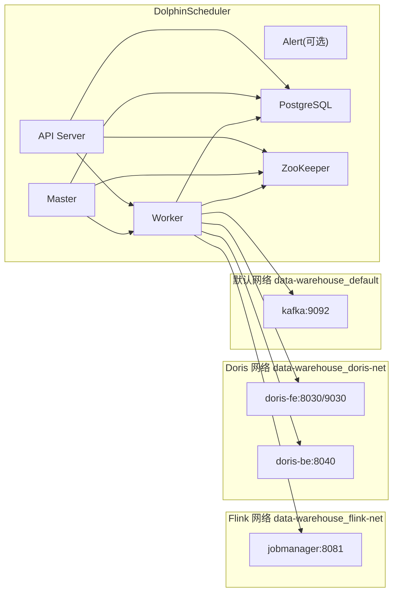

# DolphinScheduler Docker 部署方案

## 设计目标

1. DolphinScheduler 独立部署，不影响现有 `Doris`、`Flink`、`Kafka` 运行方式。
2. `Worker` 能直接访问 `jobmanager:8081`、`doris-fe:8030/9030`、`doris-be:8040`、`kafka:9092`。
3. 元数据库单独使用 `PostgreSQL`，避免和现有本地 `Doris/MySQL` 元信息混用。
4. 默认按本地轻量模式启动，优先控制内存占用。

## 网络设计



## 文件说明

1. `docker-compose-dolphinscheduler.yml`: DolphinScheduler 主部署文件。
2. `config/dolphinscheduler/dolphinscheduler.env`: 官方镜像所需环境变量。
3. `manage-dolphinscheduler.sh`: 启停、初始化、日志、连通性校验统一入口。
4. `scripts/check-dolphinscheduler-connectivity.sh`: 从 Worker 容器内部验证对 Flink / Doris / Kafka 的访问。
5. 默认不启动 `alert`，避免本地开发机额外占用一份 Java 进程内存。

## 启动流程

1. 启动 PostgreSQL 和 ZooKeeper。
2. 执行 `tools/bin/upgrade-schema.sh` 初始化或升级元数据库。
3. 启动 `api`、`master`、`worker`。
4. 执行联通性检查脚本，确认 `Worker` 可访问现有组件。
5. 如需告警服务，再显式启动完整模式。

## 使用命令

```bash
bash manage-dolphinscheduler.sh start
bash manage-dolphinscheduler.sh verify
```

完整版启动命令:

```bash
bash manage-dolphinscheduler.sh start-full
```

## 说明

1. 当前方案优先解决“DolphinScheduler 能接入现有 Flink / Doris 网络”。
2. 如果后续你要在 DolphinScheduler 里直接提交本仓库 Flink 作业，可以在 Worker 里继续补充 `Flink Client`、`Maven` 或自定义任务镜像。
3. 当前轻量版常驻服务大致为 `PostgreSQL + ZooKeeper + API + Master + Worker`，更适合 32GB 本地开发机。
