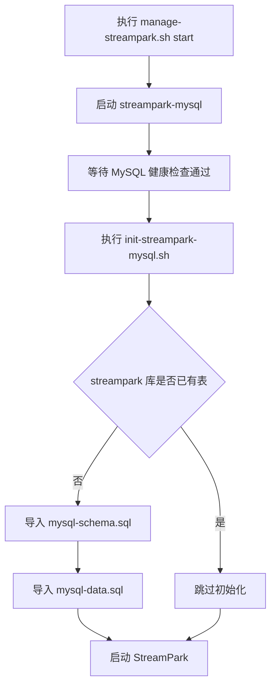

# StreamPark MySQL Docker 部署方案

## 目标

为 StreamPark 提供独立的 Docker MySQL 元数据库，并避免宿主机 Homebrew MySQL 与 Docker 端口、配置混用。

## 方案说明

1. 使用 `docker-compose-mysql.yml` 单独部署 `streampark-mysql`
2. 使用官方 StreamPark 镜像自带的 `mysql-schema.sql` 与 `mysql-data.sql` 初始化元数据库
3. `manage-streampark.sh` 启动前自动拉起 MySQL，并执行元数据库校验/补初始化
4. `StreamPark` 统一通过 Docker 网络内的 `streampark-mysql:3306` 访问元数据库

## 流程图



## 目录说明

- `docker-compose-mysql.yml`: Docker MySQL 部署文件
- `manage-mysql.sh`: MySQL 管理脚本
- `scripts/init-streampark-mysql.sh`: 元数据库补初始化脚本
- `config/streampark/mysql/init/`: 官方 schema/data SQL

## 使用方式

```bash
# 1. 停止宿主机 MySQL
brew services stop mysql
brew services stop mysql@8.0

# 2. 启动 Docker MySQL
bash manage-mysql.sh start

# 3. 启动 StreamPark
bash manage-streampark.sh start
```

## 默认信息

- MySQL 地址: `127.0.0.1:3306`
- MySQL Root 用户: `root`
- MySQL Root 密码: `Hg19951030`
- StreamPark 数据库: `streampark`
